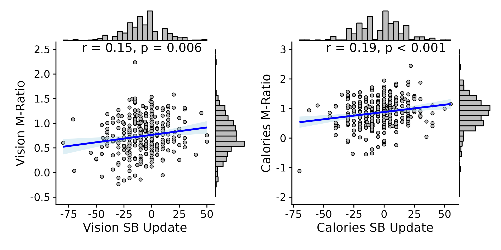

# Domain-specific Updating of Metacognitive Self-beliefs

## Authors
Kelly Hoogervorst1, Leah Banellis1, and Micah G. Allen1,2  
 
1. Center of Functionally Integrative Neuroscience, Aarhus University, Building 1710, Universitetsbyen 3, 8000 Aarhus, Denmark  
2. Cambridge Psychiatry, Cambridge University, UK  

## Abstract
Metacognitive self-monitoring of our abilities is vital for healthy cognitive functioning. This capacity to correlate subjective feelings of uncertainty with explicit self-beliefs about cognitive ability is believed to rely on a domain-general cognitive hierarchy. While substantial research supports the domain-generality of metacognitive ability, less is understood about how self-beliefs are maintained and modified in response to experiences of uncertainty. This study investigates metacognitive belief updating across various domains, including memory, visual, and general knowledge, revealing that belief updating is highly domain-specific, influenced by metacognitive testing.

## Keywords
Metacognition, Self-beliefs, Belief-updating, Domain generality, Perception, Memory

## Citing This Work
If you find this work useful in your research, please consider citing it as:

Hoogervorst, K., Banellis, L., & Allen, M. (2023). Domain-specific updating of metacognitive self-beliefs. _PsyArxiv._
https://osf.io/preprints/psyarxiv/knsb4

## Figures
Inline references to figures included in the manuscript:

## License
This project is licensed under the [MIT License](LICENSE).

